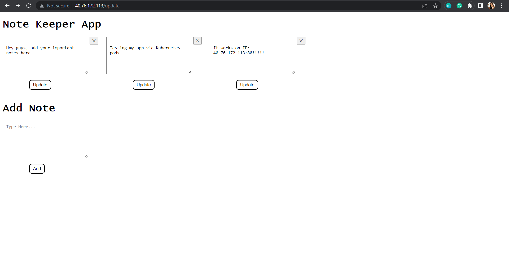

### Deploying an Application on Kubernetes

**Overview**

A node app will be containerized and pushed to ACR, after which one Kubernetes cluster will be created on AKS and a deployment and a service will be created having 4 pod replicas via a manifest file.


**What will be covered**

- Azure Kubernetes Service
- Azure Container Registry
- Docker Container
- Azure CLI
- Kubectl
- Simple Node app


**Prerequisites**

- Terminal and Azure CLI installed on local machine - some of the steps for this project (such as connecting to kubernetes cluster will be done using Azure CLI).
- Docker installed on local machine - which will be used to build an image and push to a registry (Azure Container Registry in this demo).
- Azure account with active subscription.
- Code Editor or IDE - which will be used to write code that will be containerized.
- Terraform installed - an IAC tool that will be used to provision infrastructure on Azure.

**Install**
```
git clone https://github.com/KeneOjiteli/sca-final-project
```
```
cd notes-app
```
```
npm install
```

**Run**
```
node app.js
```
Visit http://localhost:3000 in your browser

**Test**
To run tests
```
npm test
```
**Application can be accessed via http://40.76.172.113**



Visit [Deploying an Application on Kubernetes](https://dev.to/keneojiteli/deploying-an-application-on-kubernetes-3c27) to know more about this project.
